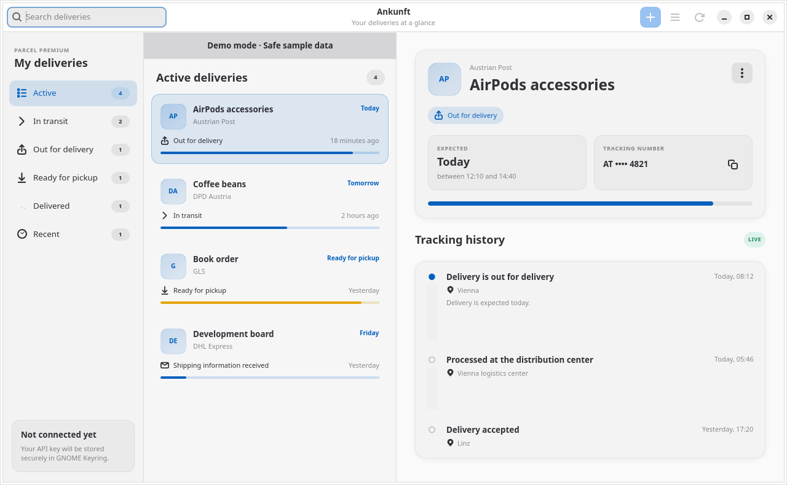

# Ankunft

[](https://github.com/Dandiccf/Ankunft/actions/workflows/ci.yml)
[](https://github.com/Dandiccf/Ankunft/actions/workflows/flatpak.yml)

A native Linux desktop companion for **[Parcel](https://parcelapp.net/)**, the
delivery-tracking service. Ankunft brings your Parcel deliveries to a GTK4 and
Libadwaita desktop window: follow shipments, add tracking numbers, browse delivery
events, and receive private status-change notifications on Linux.

**Parcel is the service at the centre of Ankunft. Live tracking requires your own
Parcel account, an active Parcel Premium subscription, and a Parcel API key.**
Parcel supplies the tracking information; Ankunft gives you a native Linux
interface to that account. Ankunft itself is free, public open-source software.
Parcel's subscription is a separate service, managed through Parcel.

**Status: 0.2.0 preview.** Source, tests and packaging are public. Preview releases
are intended for early adopters; real-account and desktop acceptance checks are
tracked in [the release checklist](docs/RELEASE-CHECKLIST.md). Ankunft is an
independent project and is not affiliated with Parcel.



## Start here

- [How Ankunft works with Parcel](#how-ankunft-works-with-parcel)
- [Features](#features)
- [Guided installation and first connection](#guided-installation-and-first-connection)
- [Get your Parcel API key](#step-5-get-your-parcel-api-key)
- [Using your connected account](#using-your-connected-account)
- [Frequently asked questions](#frequently-asked-questions)
- [Updates and uninstalling](#updates-and-uninstalling)
- [Build and install natively](#build-and-install-natively)
- [Languages and demo mode](#languages-and-demo-mode)
- [Security and local data](#security-and-local-data)
- [Troubleshooting](#troubleshooting)
- [Development and packaging](#development-and-packaging)
- [License](#license)

## How Ankunft works with Parcel

[Parcel's official website](https://parcelapp.net/) explains the service and links
to its apps for iPhone, iPad, Apple Watch and Mac. Its
[Web Access](https://web.parcelapp.net/) lets Premium users manage deliveries in
a browser. Ankunft connects to the same account through Parcel's official API.

| Part | What it does |
| --- | --- |
| **Parcel service** | Holds your Parcel account and deliveries, communicates with supported carriers, and supplies tracking updates. |
| **Parcel Premium and API key** | Enable the API access Ankunft needs to read recent deliveries and add new ones to your account. |
| **Ankunft on Linux** | Displays those deliveries, offers search and status filters, keeps a local cache/history, and provides desktop notifications while running. |

A delivery added through Ankunft is submitted to your Parcel account. A delivery
added through Parcel can appear in Ankunft on its next successful refresh,
provided it is included in Parcel's recent API view. Locally marking a delivery
as delivered in Ankunft affects only this Linux device.

Parcel describes its [delivery API](https://parcelapp.net/help/api-view-deliveries.html)
as a limited interface for Premium users on other platforms. Ankunft therefore
depends on Parcel's supported carriers, server updates, API availability and
limits. Account setup, subscription management, and editing or deleting existing
deliveries remain available through Parcel's own apps or Web Access. Ankunft's
local history contains deliveries it has observed; it cannot fetch your entire
past account history.

You can install and explore Ankunft with sample deliveries before connecting.
For live use, complete the Parcel account steps below. Ankunft is an independent
community client; Parcel support handles Parcel accounts and subscriptions, and
[Ankunft Issues](https://github.com/Dandiccf/Ankunft/issues) handles this client.

## Features

- Three-column delivery overview, search, status filters and event timelines.
- Add-delivery dialog with carrier search, local tracking-number suggestions,
  and optional postcode/email fields.
- Private local history of deliveries observed by Ankunft. Older deliveries
  outside Parcel's recent API view cannot be imported retroactively.
- Reversible, device-local delivered marks; Parcel's original status is retained.
- Automatic refresh every 15 minutes while running, plus manual refresh.
- Optional background operation after closing the window, enabled from the
  account menu for the current session. Flatpak asks the desktop for permission.
- Native status-change notifications with no tracking numbers or delivery
  descriptions in notification text. The first successful sync is silent.
- Offline cache, atomic writes and persistent protection of Parcel API limits.
- API-key storage through Secret Service, normally GNOME Keyring.
- German, English, French, Spanish, Italian and Brazilian Portuguese interfaces.
  The system language is selected automatically; unsupported languages use English.
- Application launcher, icon and D-Bus activation; compatible desktop docks may
  display unread notification badges.
- No telemetry.

## Guided installation and first connection

This tour takes you from the prerequisites to your first live delivery. You need
a Linux desktop, an internet connection, and a desktop keyring that provides
Secret Service, such as GNOME Keyring. Ankunft uses that keyring to remember your
API key securely. Button names below use the English interface; the same controls
are translated when your desktop uses another supported language.

### Step 1: Prepare your Parcel account

1. Visit **[Parcel's official website](https://parcelapp.net/)** and follow its
   download links to install the official Parcel app on a supported Apple device.
   If you already use Parcel, open your existing app and account.
2. Set up/sign in to your Parcel account in the official app and activate
   **Parcel Premium**. Check the current subscription terms there. The open-source
   Ankunft download does not include a Parcel subscription.
3. Open **[Parcel Web Access](https://web.parcelapp.net/)** in a browser and sign
   in to that same account. Its sign-in page accepts an email and password and
   also offers **Sign in with Apple**. Use the method associated with your account.
4. Confirm that Web Access opens your delivery list. You can add a real delivery
   there now, or add one from Ankunft after connecting.

Parcel's [Web Access instructions](https://web.parcelapp.net/) explicitly ask
users to install Parcel and activate Premium first. If you have forgotten your
password, those instructions point to the **Sign In** page in the official app's
settings to restore it. Ankunft's connection dialog accepts an API key; your
Parcel email and password belong on Parcel's own sign-in page.

### Step 2: Install Flatpak on Linux

Flatpak supplies the GTK/Libadwaita runtime independently of the distribution.
This is the recommended installation path for Ubuntu, Debian, Linux Mint, Fedora, Arch Linux,
openSUSE and other Linux distributions with Flatpak support, including hosts
whose native GTK libraries are too old. Packages are built for **x86_64** and
**aarch64**. Windows and macOS are not supported.

Open your terminal and check whether Flatpak is already installed:

```bash
flatpak --version
```

If it prints a version, continue to Step 3. If the command is missing, follow the
[official setup guide for your distribution](https://flathub.org/en/setup).
Common starting points are:

| Distribution | Install/check Flatpak | Official guide |
| --- | --- | --- |
| Ubuntu / Debian | `sudo apt install flatpak` | [Ubuntu](https://flathub.org/en/setup/Ubuntu), [Debian](https://flathub.org/en/setup/Debian) |
| Linux Mint | Check `flatpak --version`; follow the guide if setup is needed. | [Linux Mint](https://flathub.org/en/setup/Linux%20Mint) |
| Fedora Workstation / Silverblue / Kinoite | Flatpak is included; check `flatpak --version`. | [Fedora](https://flathub.org/en/setup/Fedora) |
| Arch Linux | `sudo pacman -S flatpak` | [Arch](https://flathub.org/en/setup/Arch) |
| openSUSE | `sudo zypper install flatpak` | [openSUSE](https://flathub.org/en/setup/openSUSE) |

Complete any restart requested by your distribution's setup guide before
continuing. Ankunft's bundle installation below uses `--user`, so the application
is installed for your Linux user without `sudo`.

### Step 3: Download the correct Ankunft package

1. Run the following command to see your computer's architecture:

   ```bash
   uname -m
   ```

2. Open **[Ankunft Releases](https://github.com/Dandiccf/Ankunft/releases)**.
   The current preview is **[v0.2.0](https://github.com/Dandiccf/Ankunft/releases/tag/v0.2.0)**.
   Expand **Assets** on the release page if the downloads are collapsed.
3. Download **both** files for the architecture reported above:

   | Architecture | Application bundle | Checksum file |
   | --- | --- | --- |
   | `x86_64` — most Intel/AMD PCs | `Ankunft-x86_64.flatpak` | `Ankunft-x86_64.flatpak.sha256` |
   | `aarch64` — 64-bit ARM | `Ankunft-aarch64.flatpak` | `Ankunft-aarch64.flatpak.sha256` |

   Choose the `.flatpak` bundle for installation; the **Source code** archives are
   for people who want to build the app themselves. Other architectures do not
   currently have a published bundle.
4. Keep the bundle and its checksum together in the same folder. Open a terminal
   in that folder using your file manager, or change directory to your browser's
   download folder. For example, if it is named `Downloads`:

   ```bash
   cd ~/Downloads
   ```

### Step 4: Verify, install and launch

Run the checksum command for your downloaded bundle first.

**Intel/AMD (`x86_64`):**

```bash
sha256sum -c Ankunft-x86_64.flatpak.sha256
```

**64-bit ARM (`aarch64`):**

```bash
sha256sum -c Ankunft-aarch64.flatpak.sha256
```

The result should end in **`OK`**. If it reports a mismatch, download both files
again from the same release before installing. If it cannot find a file, check
the terminal's current folder and the downloaded filenames.

Add the per-user Flathub remote so Flatpak can obtain the required runtime:

```bash
flatpak remote-add --user --if-not-exists flathub https://dl.flathub.org/repo/flathub.flatpakrepo
```

Then run **one** of these installation commands, matching the bundle you downloaded:

**Intel/AMD (`x86_64`):**

```bash
flatpak install --user ./Ankunft-x86_64.flatpak
```

**64-bit ARM (`aarch64`):**

```bash
flatpak install --user ./Ankunft-aarch64.flatpak
```

Review Flatpak's prompts and accept installation of the application and required
runtime. The first installation can take longer because it also downloads the
GNOME runtime. These are direct GitHub bundles; **Ankunft is not currently listed
on Flathub**. Flathub supplies its runtime.

Launch **Ankunft** from your application menu, or run:

```bash
flatpak run io.github.dandiccf.Ankunft
```

On first launch, the connection dialog may open automatically. Until you connect,
the overview shows clearly labelled synthetic sample deliveries. Those examples
let you explore the layout; your real parcels appear after a successful connection.

### Step 5: Get your Parcel API key

An API key is a secret issued by Parcel that allows Ankunft to access its API on
your behalf. You obtain it from your own Premium account in **Parcel Web**, then
paste it into Ankunft. You do not need to write code or make manual API requests.

1. Open **[Parcel Web Access](https://web.parcelapp.net/)** and sign in to the
   Premium account you prepared in Step 1. Ankunft's connection dialog also has a
   **Create an API key in Parcel Web** link to this site.
2. Open the **API** section in Parcel Web's controls. Its key-management panel is
   titled **Parcel API**.
3. If you have no key yet, select **Create a Key**. Parcel then displays your key.
   If a key already exists, you can use that existing key.
4. Select **Copy the Key**, then return to Ankunft. Treat the copied value as a
   password: keep it out of public issues, screenshots, source files and logs.

These are the English labels used by Parcel Web; they can differ when its
language changes. Parcel's official
[API documentation](https://parcelapp.net/help/api-view-deliveries.html) confirms
that keys are generated through Web Access and that API access requires Premium.
If you cannot open the API panel, check that you are signed in to the right
account and that Premium is active. For account or subscription trouble, use
the support links on [Parcel's website](https://parcelapp.net/).

### Step 6: Connect Ankunft to Parcel

1. In Ankunft, open the **Connect to Parcel** dialog. If it is not already open,
   click **Connect API** in the sample-data banner.
2. Paste the value from Parcel Web into the **Parcel API key** field. Paste only
   the key, without surrounding quotation marks or an `api-key:` prefix.
3. Click **Connect** and wait for the first request to finish. Unlock your desktop
   keyring if the desktop asks you to do so.
4. After the connection succeeds, Ankunft replaces the sample data with your
   recent Parcel deliveries and saves the verified key in Secret Service for
   future launches. An account with no recent deliveries can have an empty list;
   you can add a shipment in the next step.

If connection fails, read the error banner. Common causes are an incomplete or
revoked key, inactive Premium, unavailable networking, or a locked/unavailable
keyring. Correct the cause and retry; see [Troubleshooting](#troubleshooting).

For later key changes, open the account menu in the header and choose **Change
API key**. Parcel Web offers **Revoke the Key** if you need to disable a compromised
key; revoking it affects every client using that key. Generate/copy a replacement
and update Ankunft and any other integrations that need it.

### Step 7: Take a first tour of the app

1. **Browse your deliveries.** Select a status in the left sidebar, use the search
   field to find a description, tracking number or carrier, and click a delivery
   in the middle list to see its details and event timeline on the right.
2. **Add a shipment.** Click the **+** button in the header. Enter a **Description**
   that will help you recognise the package, its **Tracking number**, and the
   **Carrier**. Verify any suggested carrier against the actual shipping service.
   Fill in the postal code or email under **Optional information** if your carrier
   requires it, then click **Add**. The shipment is submitted to Parcel; tracking
   events can arrive later, after Parcel's next server update.
3. **Refresh the overview.** Use the refresh button in the header when needed.
   Ankunft also checks every 15 minutes while running. A refresh reads Parcel's
   latest available API snapshot; it does not ask the carrier to update immediately.
4. **Choose background operation.** Open the account menu and enable **Keep
   running in the background** if you want monitoring to continue after closing
   the window. Accept the desktop's background permission request if one appears.
   This choice applies to the current running session.
5. **Understand notifications.** The first successful sync is silent. Subsequent
   delivery status changes can produce desktop notifications while Ankunft is
   running and desktop permissions allow them.

For a delivery you consider complete, its local delivered mark can be toggled
back later. It does not overwrite the status in your Parcel account. You can
return to your original Parcel apps or Web Access to manage account settings and
edit/delete existing deliveries.

## Using your connected account

On later launches, Ankunft retrieves its saved key from the desktop keyring and
can display cached deliveries while restoring the connection. Local history
preserves completed deliveries that Ankunft has observed, even after they fall
outside Parcel's recent API view. Keep the app running when you want ongoing
refreshes and desktop notifications.

### Refresh and background behavior

Deliveries refresh on connection/startup when the cached snapshot is older than
15 minutes, then every 15 minutes while the app runs. Manual refresh is available
from the header. Refreshes do not overlap active requests or account dialogs.
Parcel's API returns server-cached data; polling does not force a carrier update.

Closing the window normally exits. Enable **Keep running in the background** in
the account menu to keep refreshing and receiving notifications after closing
it. Reopen from the launcher or a notification. Use **Quit** or Ctrl+Q to stop it.
The background choice resets when the process exits; there is no login autostart
or tray icon. A desktop portal may deny background operation in a sandbox.

The [Parcel read API](https://parcelapp.net/help/api-view-deliveries.html) permits
20 requests per hour. The [add API](https://parcelapp.net/help/api-add-delivery.html)
permits 20 attempts per day, including rejected tracking numbers. Ankunft records
attempts before sending requests and never automatically retries delivery
creation. Other clients using the same account can also consume server limits.

## Frequently asked questions

**Is Ankunft free to install and use?**

Yes. Ankunft is MIT-licensed open-source software. Live account access depends
on a separate Parcel Premium subscription. You can explore sample deliveries
without connecting an account.

**Can I use an existing Parcel account entirely from this Linux app?**

You can connect an existing Premium account, read its recent deliveries and add
shipments from Linux. Use Parcel's official apps for account/subscription setup,
and its apps or Web Access for editing and deleting existing deliveries.

**Why does a new delivery have no tracking events?**

Parcel accepts and validates the shipment first. Carrier events become available
after the service updates it. Refreshing Ankunft retrieves the server's current
snapshot; it does not force that update. See the
[official add-delivery documentation](https://parcelapp.net/help/api-add-delivery.html).

**Will I see all of my old Parcel deliveries?**

The API exposes a recent/active view. Ankunft keeps local history for deliveries
it observes while connected; deliveries already outside that view cannot be
imported retroactively.

**Does removing Ankunft cancel Parcel Premium or delete my Parcel account?**

No. Uninstalling or removing the local connection affects this Linux client.
Manage your subscription and account through Parcel. If you want to disable the
API key itself, revoke it through Parcel Web as described in Step 6.

**Will it monitor parcels after I log out or restart the computer?**

Launch Ankunft again after logging in. Background operation is optional and lasts
for the current process; there is no automatic start at login. Closing the window
continues monitoring only when background operation has been enabled and allowed.

## Updates and uninstalling

To update a Flatpak installation, quit Ankunft, download the matching bundle and
checksum from the new [release](https://github.com/Dandiccf/Ankunft/releases),
verify them, and repeat the installation command from Step 4. Flatpak preserves
the application's local data, and the key remains in the desktop keyring. Launch
Ankunft again after installation. Direct GitHub bundle updates are installed this
way; check the releases page for new versions.

To uninstall while retaining local data:

```bash
flatpak uninstall --user io.github.dandiccf.Ankunft
```

If you also want to disconnect this Linux installation, first open Ankunft's
account menu and choose **Remove connection**. This deletes its keyring entry and
attempts to clear its local delivery cache; storage errors are shown explicitly.
It leaves your Parcel account and deliveries available in Parcel. Disconnecting
Ankunft does not revoke the key in Parcel Web.

Flatpak's `--delete-data` option removes sandbox data, but does not delete an API
key held separately in the desktop keyring. The native uninstall command is
documented below. See [Security and local data](#security-and-local-data) for
storage details.

## Build and install natively

Native builds require **Rust 1.92+**, **GTK 4.12+**, **Libadwaita 1.5+**,
**Libsecret 0.20+**, GNU gettext, a C compiler and pkg-config. Install Rust with
[rustup](https://rustup.rs/) if your distribution's Rust package is older.

The CI matrix builds and starts the demo on Ubuntu 24.04, Debian 13, Fedora 44,
Arch Linux and openSUSE Tumbleweed. This checks compilation and desktop startup;
it does not certify every desktop session or every version of each distribution.
Debian 12 and Ubuntu 22.04 should use the Flatpak because their native toolkit
versions are below the minimum.

### Ubuntu 24.04+ / Debian 13+

```bash
sudo apt install build-essential pkg-config libgtk-4-dev libadwaita-1-dev libsecret-1-dev gettext
```

### Fedora

```bash
sudo dnf install gcc pkgconf-pkg-config gtk4-devel libadwaita-devel libsecret-devel gettext
```

### Arch Linux

```bash
sudo pacman -S --needed base-devel gtk4 libadwaita libsecret gettext
```

### openSUSE Tumbleweed

```bash
sudo zypper install gcc pkg-config gtk4-devel libadwaita-devel libsecret-devel gettext-tools
```

Then clone, build and install without administrator privileges:

```bash
git clone https://github.com/Dandiccf/Ankunft.git
cd Ankunft
cargo build --release --locked
./scripts/install-user.sh
```

The executable goes in `~/.local/bin`; desktop integration and translations go
in `${XDG_DATA_HOME:-~/.local/share}`. Launch from the application menu, or run
`~/.local/bin/ankunft`. For development, use `cargo run --locked`.

```bash
./scripts/uninstall-user.sh
```

Uninstalling application files preserves the keyring entry and offline state.
The install/uninstall scripts intentionally refuse to run as root.

## Languages and demo mode

The interface follows `LC_ALL`, `LC_MESSAGES`, `LANG`, and gettext's `LANGUAGE`
preferences. For example, from a UTF-8 desktop session:

```bash
LANGUAGE=fr ~/.local/bin/ankunft
flatpak run --env=LANGUAGE=pt_BR io.github.dandiccf.Ankunft
```

The C/POSIX locale and unsupported languages use English. For a different
language, quit the existing process before relaunching. Delivery descriptions,
carrier-provided events and ambiguous date strings are displayed as supplied by
Parcel; the UI cannot translate external account data. Native carrier search
uses prefixes on Libadwaita 1.5 and substrings on 1.6+.

A separate demo instance never reads or writes the account's cache, keyring or
API counters and never makes API requests:

```bash
cargo run --locked -- --demo
flatpak run io.github.dandiccf.Ankunft --demo
```

## Security and local data

The API key is stored through the desktop's Secret Service. GNOME Keyring is the
usual provider; another compatible provider can work on other desktops. A
running, unlocked service is required for connection. Keys are not saved in
plain-text configuration files. HTTPS uses Rustls and redirects are disabled.

Normalized delivery data is stored with private directory/file permissions and
atomic replacement. It is not encrypted at rest. Native state lives under
`${XDG_STATE_HOME:-~/.local/state}/io.github.dandiccf.Ankunft/`:

- `deliveries-v1.json`: versioned delivery cache and local delivered marks.
- `rate-limits-v1.json`: persistent API-attempt counters.

In Flatpak, those paths are inside `~/.var/app/io.github.dandiccf.Ankunft/`.
The API counter remains when disconnecting to avoid accidentally bypassing
limits. There is no telemetry. Flatpak permissions include network access,
graphics and access to Secret Service; it does not receive general home-directory
access. See [SECURITY.md](SECURITY.md) for vulnerability reporting.

## Troubleshooting

| Symptom | What to check |
| --- | --- |
| Missing GTK/Libadwaita or pkg-config build error | Check the minimum versions above and install development packages, or use Flatpak. |
| Rust version is too old | Update using rustup; the locked GTK bindings need Rust 1.92+. |
| `msgfmt` not found | Install GNU gettext (`gettext-tools` on openSUSE). |
| `flatpak: command not found` | Complete the Flatpak setup for your distribution in Step 2. |
| Checksum cannot find the bundle | Keep both downloaded files in the same folder and run the check from that folder. |
| Parcel Web sign-in fails | Use your existing Parcel account's sign-in method; recover a forgotten password through the official app's settings. |
| API-key panel unavailable in Parcel Web | Check the account and Premium status, then contact Parcel support for service/account problems. |
| Keyring unavailable or locked | Unlock GNOME Keyring or enable a compatible Secret Service provider in the desktop session. |
| Live data unavailable | Check network access, Premium status, the API key and the error banner. Cached deliveries remain available. |
| API limit reached | Wait for the rolling limit to expire; do not erase the counters to retry. |
| New delivery has no events yet | Parcel validates creation first; carrier data appears after its next server update. |
| Old delivery missing | Parcel exposes a limited recent view. Local history only contains deliveries Ankunft has observed. |
| No notifications after closing | Enable background operation and check desktop notification/background permissions. Quit stops monitoring. |
| Launcher missing after native install | Try `~/.local/bin/ankunft`, then log out/in to refresh the application menu. |
| Wrong language | Quit the current process, check the locale environment, and relaunch. |

Report reproducible problems in [GitHub Issues](https://github.com/Dandiccf/Ankunft/issues).
Include the version, distro, desktop, installation method and reproduction steps;
remove credentials, tracking numbers and personal delivery data.

## Development and packaging

See [CONTRIBUTING.md](CONTRIBUTING.md), [architecture](docs/ARCHITECTURE.md) and
[packaging instructions](docs/PACKAGING.md). CI checks formatting, Clippy, tests,
translation coverage/placeholders, desktop and AppStream metadata, five distro
builds, and Flatpak installation/startup for x86_64 and aarch64.

## License

Ankunft is public open-source software under the [MIT license](LICENSE).
Application metadata is CC0-1.0 as declared in its AppStream file.
